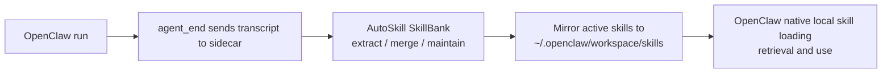

# AutoSkill OpenClaw Plugin

[中文说明](./README.zh-CN.md)

Teach OpenClaw new reusable skills without modifying OpenClaw core.

This plugin runs a local sidecar that:

- receives OpenClaw conversation data
- extracts and maintains skills in AutoSkill `SkillBank`
- mirrors active skills into OpenClaw's standard local skills directory
- lets OpenClaw use those skills through its native local skill flow

The default recommended model is simple:

`OpenClaw -> sidecar extraction/maintenance -> mirror to OpenClaw local skills -> OpenClaw native skill usage`

That keeps the responsibilities clean:

- sidecar = learning, maintenance, archive, mirror
- OpenClaw = loading, retrieving, and using local skills normally

## Install

### Prerequisites

- Python 3.10+
- A local checkout of this AutoSkill repository
- Valid LLM and embedding credentials

### Install from this repo

```bash
git clone https://github.com/ECNU-ICALK/AutoSkill.git
cd AutoSkill
python3 -m pip install -e .
python3 OpenClaw-Plugin/install.py \
  --workspace-dir ~/.openclaw \
  --install-dir ~/.openclaw/plugins/autoskill-openclaw-plugin \
  --adapter-dir ~/.openclaw/extensions/autoskill-openclaw-adapter \
  --repo-dir "$(pwd)" \
  --llm-provider internlm \
  --llm-model intern-s1-pro \
  --embeddings-provider qwen \
  --embeddings-model text-embedding-v4
```

If you already have the repo locally:

```bash
cd /path/to/AutoSkill
python3 -m pip install -e .
python3 OpenClaw-Plugin/install.py \
  --workspace-dir ~/.openclaw \
  --install-dir ~/.openclaw/plugins/autoskill-openclaw-plugin \
  --adapter-dir ~/.openclaw/extensions/autoskill-openclaw-adapter \
  --repo-dir "$(pwd)" \
  --llm-provider internlm \
  --llm-model intern-s1-pro \
  --embeddings-provider qwen \
  --embeddings-model text-embedding-v4
```

### What installation creates

- `~/.openclaw/plugins/autoskill-openclaw-plugin/.env`
- `~/.openclaw/plugins/autoskill-openclaw-plugin/run.sh`
- `~/.openclaw/plugins/autoskill-openclaw-plugin/start.sh`
- `~/.openclaw/plugins/autoskill-openclaw-plugin/stop.sh`
- `~/.openclaw/plugins/autoskill-openclaw-plugin/status.sh`
- `~/.openclaw/extensions/autoskill-openclaw-adapter/index.js`
- `~/.openclaw/extensions/autoskill-openclaw-adapter/openclaw.plugin.json`
- `~/.openclaw/extensions/autoskill-openclaw-adapter/package.json`
- `~/.openclaw/openclaw.json` with the adapter entry enabled

## Quick Start

### 1. Edit the sidecar `.env`

```bash
vim ~/.openclaw/plugins/autoskill-openclaw-plugin/.env
```

Fill in at least:

- your LLM provider key
- your embedding provider key

The default recommended mode is already configured:

```bash
AUTOSKILL_OPENCLAW_SKILL_INSTALL_MODE=openclaw_mirror
AUTOSKILL_OPENCLAW_MAIN_TURN_EXTRACT=1
AUTOSKILL_OPENCLAW_CONVERSATION_ARCHIVE_ENABLED=1
```

### 2. Start the sidecar

```bash
~/.openclaw/plugins/autoskill-openclaw-plugin/start.sh
~/.openclaw/plugins/autoskill-openclaw-plugin/status.sh
```

### 3. Verify the service

```bash
curl http://127.0.0.1:9100/health
curl http://127.0.0.1:9100/v1/autoskill/capabilities
```

### 4. Restart OpenClaw

```bash
openclaw gateway restart
```

If your environment does not expose the `openclaw` CLI, restart the OpenClaw gateway/runtime through your normal service manager.

### 5. Check that the plugin is wired

```bash
cat ~/.openclaw/openclaw.json
```

You should see:

- `plugins.load.paths` contains `~/.openclaw/extensions/autoskill-openclaw-adapter`
- `plugins.entries.autoskill-openclaw-adapter.enabled = true`
- `plugins.entries.autoskill-openclaw-adapter.config.baseUrl = http://127.0.0.1:9100/v1`

## What This Plugin Does

### Default recommended path

This is the path most users should adopt first.



In this mode:

- OpenClaw sends run data to the sidecar.
- The sidecar archives the transcript locally.
- The sidecar extracts and maintains skills in AutoSkill `SkillBank`.
- The sidecar mirrors active skills into OpenClaw's standard local skills directory.
- OpenClaw uses those mirrored skills through its normal local skill mechanism.

### Why this is the default

- No OpenClaw core patching.
- No custom ContextEngine required.
- No system prompt replacement.
- No direct interference with memory, compaction, tools, provider selection, or model routing.
- OpenClaw keeps using its own standard local skill behavior.

## Default Behavior

### Recommended install mode

The default install mode is:

```bash
AUTOSKILL_OPENCLAW_SKILL_INSTALL_MODE=openclaw_mirror
```

That means:

- AutoSkill `SkillBank` is the source of truth.
- OpenClaw local skills are an install mirror, not the source of truth.
- `before_prompt_build` retrieval injection is disabled by default to avoid double retrieval and double guidance.
- `agent_end` is the default online data path unless you explicitly route model traffic through the advanced main-turn proxy.

### What gets stored locally

- SkillBank: `~/.openclaw/autoskill/SkillBank`
- Conversation archive: `~/.openclaw/autoskill/conversations`
- Mirrored OpenClaw local skills: `~/.openclaw/workspace/skills`

## Optional Paths

### 1. `store_only` plus `before_prompt_build` injection

Use this only if you do not want skills mirrored into OpenClaw local skills.

In this mode:

- skills stay in AutoSkill store
- the adapter retrieves skills before prompt build
- the adapter injects a short additive skill hint block

Important properties:

- it only uses `before_prompt_build`
- it does not replace `systemPrompt`
- it does not mutate `messages`
- it does not touch memory slots or contextEngine
- it still follows the original AutoSkill retrieval flow: `query rewrite -> retrieval`

Enable it by switching to:

```bash
AUTOSKILL_OPENCLAW_SKILL_INSTALL_MODE=store_only
```

Or explicitly:

```bash
AUTOSKILL_SKILL_RETRIEVAL_ENABLED=1
```

### 2. Advanced main-turn proxy

Use this only if you want more precise `main turn -> next state` sampling than `agent_end` can provide.

The sidecar exposes:

- `POST /v1/chat/completions`

When OpenClaw model traffic is routed there, the sidecar:

- samples only `turn_type == main`
- waits for the next request in the same session
- uses the final `user` / `tool` / `environment` message as `next_state`
- schedules extraction only after the turn boundary is complete

Important:

- `AUTOSKILL_OPENCLAW_MAIN_TURN_EXTRACT=1` is the default
- the chat proxy only becomes usable after `AUTOSKILL_OPENCLAW_PROXY_TARGET_BASE_URL` is configured
- if the target is not configured, `/v1/chat/completions` returns `503`
- in that case, online extraction automatically falls back to `agent_end`

## How OpenClaw and the Sidecar Interact

### Default online extraction path

By default, OpenClaw sends end-of-task data through:

- `POST /v1/autoskill/openclaw/hooks/agent_end`

The sidecar then:

1. archives the transcript locally
2. checks whether extraction should run
3. updates `SkillBank`
4. mirrors active skills into OpenClaw local skills

### Relationship between `agent_end` and main-turn proxy

- If main-turn proxy is active and model traffic really goes through sidecar `/v1/chat/completions`, main-turn extraction is preferred.
- In that setup, `agent_end` becomes archive-only and does not schedule a second extraction job.
- If main-turn proxy is not active, or the upstream target is not configured, `agent_end` remains the online extraction path.
- Fallback extraction only runs for payloads with `turn_type == main`.

## Useful Operations

### Start / stop / status

```bash
~/.openclaw/plugins/autoskill-openclaw-plugin/start.sh
~/.openclaw/plugins/autoskill-openclaw-plugin/status.sh
~/.openclaw/plugins/autoskill-openclaw-plugin/stop.sh
```

### Manual mirror sync

```bash
curl -X POST http://127.0.0.1:9100/v1/autoskill/openclaw/skills/sync \
  -H "Content-Type: application/json" \
  -d '{"user":"u1"}'
```

### Extraction events

```bash
curl http://127.0.0.1:9100/v1/autoskill/extractions/latest?user=<user_id>
curl -N http://127.0.0.1:9100/v1/autoskill/extractions/<job_id>/events
```

### Offline conversation import

```bash
curl -X POST http://127.0.0.1:9100/v1/autoskill/conversations/import \
  -H "Content-Type: application/json" \
  -d '{
    "conversations": [
      {
        "messages": [
          {"role":"user","content":"Write a policy memo."},
          {"role":"assistant","content":"Draft ..."},
          {"role":"user","content":"Make it more specific."}
        ]
      }
    ]
  }'
```

## Key Environment Variables

### Core runtime

- `AUTOSKILL_PROXY_HOST`
- `AUTOSKILL_PROXY_PORT`
- `AUTOSKILL_STORE_DIR`
- `AUTOSKILL_LLM_PROVIDER`
- `AUTOSKILL_LLM_MODEL`
- `AUTOSKILL_EMBEDDINGS_PROVIDER`
- `AUTOSKILL_EMBEDDINGS_MODEL`
- `AUTOSKILL_PROXY_API_KEY`

### Default recommended path

- `AUTOSKILL_OPENCLAW_SKILL_INSTALL_MODE=openclaw_mirror`
- `AUTOSKILL_OPENCLAW_SKILLS_DIR`
- `AUTOSKILL_OPENCLAW_INSTALL_USER_ID`
- `AUTOSKILL_OPENCLAW_CONVERSATION_ARCHIVE_ENABLED`
- `AUTOSKILL_OPENCLAW_CONVERSATION_ARCHIVE_DIR`

### Optional retrieval injection path

- `AUTOSKILL_SKILL_RETRIEVAL_ENABLED`
- `AUTOSKILL_SKILL_RETRIEVAL_TOP_K`
- `AUTOSKILL_SKILL_RETRIEVAL_MAX_CHARS`
- `AUTOSKILL_SKILL_RETRIEVAL_MIN_SCORE`
- `AUTOSKILL_SKILL_RETRIEVAL_INJECTION_MODE`
- `AUTOSKILL_REWRITE_MODE`

### Optional main-turn proxy path

- `AUTOSKILL_OPENCLAW_MAIN_TURN_EXTRACT`
- `AUTOSKILL_OPENCLAW_AGENT_END_EXTRACT`
- `AUTOSKILL_OPENCLAW_PROXY_TARGET_BASE_URL`
- `AUTOSKILL_OPENCLAW_PROXY_TARGET_API_KEY`
- `AUTOSKILL_OPENCLAW_PROXY_CONNECT_TIMEOUT_S`
- `AUTOSKILL_OPENCLAW_PROXY_READ_TIMEOUT_S`
- `AUTOSKILL_OPENCLAW_INGEST_WINDOW`

## API Summary

### Core OpenClaw-facing endpoints

- `POST /v1/autoskill/openclaw/hooks/agent_end`
- `POST /v1/autoskill/openclaw/hooks/before_agent_start`
- `POST /v1/autoskill/openclaw/skills/sync`
- `POST /v1/autoskill/openclaw/turn`
- `POST /v1/chat/completions` for the optional main-turn proxy

### Skill and extraction endpoints

- `POST /v1/autoskill/extractions`
- `GET /v1/autoskill/extractions/latest`
- `GET /v1/autoskill/extractions`
- `GET /v1/autoskill/extractions/{job_id}`
- `GET /v1/autoskill/extractions/{job_id}/events`
- `POST /v1/autoskill/conversations/import`
- `POST /v1/autoskill/skills/search`
- `GET /v1/autoskill/skills`
- `GET /v1/autoskill/skills/{skill_id}`
- `PUT /v1/autoskill/skills/{skill_id}/md`
- `DELETE /v1/autoskill/skills/{skill_id}`
- `POST /v1/autoskill/skills/{skill_id}/rollback`

## Repository and Install Paths

- GitHub source:
  [OpenClaw-Plugin on GitHub](https://github.com/ECNU-ICALK/AutoSkill/tree/main/OpenClaw-Plugin)
- Repo manifest:
  `OpenClaw-Plugin/sidecar.manifest.json`
- Runtime install dir:
  `~/.openclaw/plugins/autoskill-openclaw-plugin`
- Adapter dir:
  `~/.openclaw/extensions/autoskill-openclaw-adapter`
- OpenClaw config:
  `~/.openclaw/openclaw.json`

## Notes

- The sidecar does not replace OpenClaw memory behavior.
- The sidecar does not require a custom ContextEngine.
- In the default mirror mode, OpenClaw uses standard local skills instead of a second sidecar retrieval path.
- If `openclaw.json` is invalid JSON, the installer stops instead of overwriting it.
