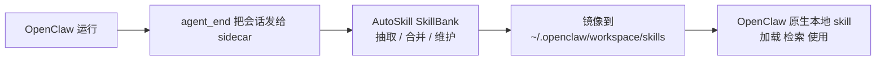

# AutoSkill OpenClaw 插件

[English](./README.md)

让 OpenClaw 在不改核心代码的前提下，持续学会新技能。

这个插件会启动一个本地 sidecar，它负责：

- 接收 OpenClaw 发来的对话数据
- 在 AutoSkill `SkillBank` 中完成技能抽取与维护
- 把当前有效技能镜像到 OpenClaw 标准本地 skills 目录
- 让 OpenClaw 继续按原生本地 skill 机制去检索和使用这些技能

默认推荐的理解方式只有一条主线：

`OpenClaw -> sidecar 抽取/维护 -> mirror 到 OpenClaw 本地 skills -> OpenClaw 原生 skill 使用`

职责划分也很清楚：

- sidecar = 学习、维护、归档、镜像
- OpenClaw = 正常加载、检索、使用本地 skill

## 安装

### 前置依赖

- Python 3.10+
- 本地已有 AutoSkill 仓库
- 已准备好可用的 LLM 和 embedding 凭据

### 从当前仓库安装

```bash
git clone https://github.com/ECNU-ICALK/AutoSkill.git
cd AutoSkill
python3 -m pip install -e .
python3 OpenClaw-Plugin/install.py \
  --workspace-dir ~/.openclaw \
  --install-dir ~/.openclaw/plugins/autoskill-openclaw-plugin \
  --adapter-dir ~/.openclaw/extensions/autoskill-openclaw-adapter \
  --repo-dir "$(pwd)" \
  --llm-provider internlm \
  --llm-model intern-s1-pro \
  --embeddings-provider qwen \
  --embeddings-model text-embedding-v4
```

如果仓库已经在本地：

```bash
cd /path/to/AutoSkill
python3 -m pip install -e .
python3 OpenClaw-Plugin/install.py \
  --workspace-dir ~/.openclaw \
  --install-dir ~/.openclaw/plugins/autoskill-openclaw-plugin \
  --adapter-dir ~/.openclaw/extensions/autoskill-openclaw-adapter \
  --repo-dir "$(pwd)" \
  --llm-provider internlm \
  --llm-model intern-s1-pro \
  --embeddings-provider qwen \
  --embeddings-model text-embedding-v4
```

### 安装后会生成什么

- `~/.openclaw/plugins/autoskill-openclaw-plugin/.env`
- `~/.openclaw/plugins/autoskill-openclaw-plugin/run.sh`
- `~/.openclaw/plugins/autoskill-openclaw-plugin/start.sh`
- `~/.openclaw/plugins/autoskill-openclaw-plugin/stop.sh`
- `~/.openclaw/plugins/autoskill-openclaw-plugin/status.sh`
- `~/.openclaw/extensions/autoskill-openclaw-adapter/index.js`
- `~/.openclaw/extensions/autoskill-openclaw-adapter/openclaw.plugin.json`
- `~/.openclaw/extensions/autoskill-openclaw-adapter/package.json`
- `~/.openclaw/openclaw.json`，并自动启用 adapter

## 快速开始

### 1. 编辑 sidecar 的 `.env`

```bash
vim ~/.openclaw/plugins/autoskill-openclaw-plugin/.env
```

至少填好：

- 你的 LLM provider key
- 你的 embedding provider key

默认推荐模式已经预置好：

```bash
AUTOSKILL_OPENCLAW_SKILL_INSTALL_MODE=openclaw_mirror
AUTOSKILL_OPENCLAW_MAIN_TURN_EXTRACT=1
AUTOSKILL_OPENCLAW_CONVERSATION_ARCHIVE_ENABLED=1
```

### 2. 启动 sidecar

```bash
~/.openclaw/plugins/autoskill-openclaw-plugin/start.sh
~/.openclaw/plugins/autoskill-openclaw-plugin/status.sh
```

### 3. 验证服务

```bash
curl http://127.0.0.1:9100/health
curl http://127.0.0.1:9100/v1/autoskill/capabilities
```

### 4. 重启 OpenClaw

```bash
openclaw gateway restart
```

如果你的环境没有 `openclaw` CLI，就用现有的服务管理方式重启 OpenClaw gateway/runtime。

### 5. 确认插件已经接上

```bash
cat ~/.openclaw/openclaw.json
```

你应该能看到：

- `plugins.load.paths` 包含 `~/.openclaw/extensions/autoskill-openclaw-adapter`
- `plugins.entries.autoskill-openclaw-adapter.enabled = true`
- `plugins.entries.autoskill-openclaw-adapter.config.baseUrl = http://127.0.0.1:9100/v1`

## 这个插件到底做什么

### 默认推荐路径

这是大多数用户最应该先采用的路径。



在这个模式下：

- OpenClaw 把运行数据发给 sidecar
- sidecar 先把 transcript 归档到本地
- sidecar 在 AutoSkill `SkillBank` 中完成技能抽取与维护
- sidecar 把当前有效技能镜像到 OpenClaw 标准本地 skills 目录
- OpenClaw 继续通过自己的标准本地 skill 机制来使用这些技能

### 为什么默认推荐这条路

- 不需要改 OpenClaw 核心
- 不需要自定义 ContextEngine
- 不替换 system prompt
- 不直接干扰 memory、compaction、tools、provider 选择
- OpenClaw 继续按它原本的本地 skill 行为工作

## 默认行为

### 默认安装模式

默认安装模式是：

```bash
AUTOSKILL_OPENCLAW_SKILL_INSTALL_MODE=openclaw_mirror
```

这意味着：

- AutoSkill `SkillBank` 是技能真源
- OpenClaw 本地 skills 目录只是安装镜像，不是真源
- `before_prompt_build` 的检索注入默认关闭，避免重复检索、重复提示
- 除非你显式把模型流量接到高级的 main-turn proxy，否则 `agent_end` 就是默认在线数据入口

### 本地会存什么

- SkillBank：`~/.openclaw/autoskill/SkillBank`
- 对话归档：`~/.openclaw/autoskill/conversations`
- OpenClaw 本地技能镜像：`~/.openclaw/workspace/skills`

## 可选路径

### 1. `store_only` 加 `before_prompt_build` 注入

只有当你不想把技能镜像安装到 OpenClaw 本地 skills 目录时，才建议用这条路。

这个模式下：

- 技能只保存在 AutoSkill store
- adapter 会在 prompt build 前做技能检索
- adapter 会把简短技能提示块追加到 prompt 中

它有几个关键性质：

- 只用 `before_prompt_build`
- 不替换 `systemPrompt`
- 不修改 `messages`
- 不触碰 memory slot 或 contextEngine
- 检索链路仍然遵循原来的 AutoSkill 逻辑：`query rewrite -> retrieval`

开启方式：

```bash
AUTOSKILL_OPENCLAW_SKILL_INSTALL_MODE=store_only
```

或者显式：

```bash
AUTOSKILL_SKILL_RETRIEVAL_ENABLED=1
```

### 2. 高级 main-turn proxy

只有当你需要比 `agent_end` 更精确的 `main turn -> next state` 采样时，才建议启用这条路。

sidecar 会暴露：

- `POST /v1/chat/completions`

当 OpenClaw 的模型流量走到这里时，sidecar 会：

- 只采样 `turn_type == main`
- 等同一 session 的下一次请求
- 用最后一条 `user` / `tool` / `environment` 作为 `next_state`
- 在 turn 边界真正补全后再调度抽取

要点：

- `AUTOSKILL_OPENCLAW_MAIN_TURN_EXTRACT=1` 默认就是开启的
- 只有配置了 `AUTOSKILL_OPENCLAW_PROXY_TARGET_BASE_URL`，chat proxy 才真正可用
- 如果 target 没配，`/v1/chat/completions` 会返回 `503`
- 这时在线抽取会自动回退到 `agent_end`

## OpenClaw 和 sidecar 的协作方式

### 默认在线抽取入口

默认情况下，OpenClaw 会通过下面这个接口把结束态数据发给 sidecar：

- `POST /v1/autoskill/openclaw/hooks/agent_end`

sidecar 收到后会：

1. 先把 transcript 归档到本地
2. 判断是否要执行抽取
3. 更新 `SkillBank`
4. 把当前有效技能镜像到 OpenClaw 本地 skills 目录

### `agent_end` 和 main-turn proxy 的关系

- 如果 main-turn proxy 已开启，且模型流量真的走 sidecar `/v1/chat/completions`，sidecar 会优先用 main-turn 抽取
- 这时 `agent_end` 只负责归档，不会再调度第二次抽取
- 如果 main-turn proxy 没真正生效，`agent_end` 仍然是在线抽取入口
- fallback 抽取只会对 `turn_type == main` 的 payload 触发

## 常用操作

### 启动 / 停止 / 状态

```bash
~/.openclaw/plugins/autoskill-openclaw-plugin/start.sh
~/.openclaw/plugins/autoskill-openclaw-plugin/status.sh
~/.openclaw/plugins/autoskill-openclaw-plugin/stop.sh
```

### 手动触发一次镜像同步

```bash
curl -X POST http://127.0.0.1:9100/v1/autoskill/openclaw/skills/sync \
  -H "Content-Type: application/json" \
  -d '{"user":"u1"}'
```

### 查看抽取事件

```bash
curl http://127.0.0.1:9100/v1/autoskill/extractions/latest?user=<user_id>
curl -N http://127.0.0.1:9100/v1/autoskill/extractions/<job_id>/events
```

### 离线导入会话

```bash
curl -X POST http://127.0.0.1:9100/v1/autoskill/conversations/import \
  -H "Content-Type: application/json" \
  -d '{
    "conversations": [
      {
        "messages": [
          {"role":"user","content":"写一份政策备忘录。"},
          {"role":"assistant","content":"初稿 ..."},
          {"role":"user","content":"再具体一点。"}
        ]
      }
    ]
  }'
```

## 关键环境变量

### 运行时基础配置

- `AUTOSKILL_PROXY_HOST`
- `AUTOSKILL_PROXY_PORT`
- `AUTOSKILL_STORE_DIR`
- `AUTOSKILL_LLM_PROVIDER`
- `AUTOSKILL_LLM_MODEL`
- `AUTOSKILL_EMBEDDINGS_PROVIDER`
- `AUTOSKILL_EMBEDDINGS_MODEL`
- `AUTOSKILL_PROXY_API_KEY`

### 默认推荐路径

- `AUTOSKILL_OPENCLAW_SKILL_INSTALL_MODE=openclaw_mirror`
- `AUTOSKILL_OPENCLAW_SKILLS_DIR`
- `AUTOSKILL_OPENCLAW_INSTALL_USER_ID`
- `AUTOSKILL_OPENCLAW_CONVERSATION_ARCHIVE_ENABLED`
- `AUTOSKILL_OPENCLAW_CONVERSATION_ARCHIVE_DIR`

### 可选检索注入路径

- `AUTOSKILL_SKILL_RETRIEVAL_ENABLED`
- `AUTOSKILL_SKILL_RETRIEVAL_TOP_K`
- `AUTOSKILL_SKILL_RETRIEVAL_MAX_CHARS`
- `AUTOSKILL_SKILL_RETRIEVAL_MIN_SCORE`
- `AUTOSKILL_SKILL_RETRIEVAL_INJECTION_MODE`
- `AUTOSKILL_REWRITE_MODE`

### 可选 main-turn proxy 路径

- `AUTOSKILL_OPENCLAW_MAIN_TURN_EXTRACT`
- `AUTOSKILL_OPENCLAW_AGENT_END_EXTRACT`
- `AUTOSKILL_OPENCLAW_PROXY_TARGET_BASE_URL`
- `AUTOSKILL_OPENCLAW_PROXY_TARGET_API_KEY`
- `AUTOSKILL_OPENCLAW_PROXY_CONNECT_TIMEOUT_S`
- `AUTOSKILL_OPENCLAW_PROXY_READ_TIMEOUT_S`
- `AUTOSKILL_OPENCLAW_INGEST_WINDOW`

## API 一览

### 面向 OpenClaw 的核心接口

- `POST /v1/autoskill/openclaw/hooks/agent_end`
- `POST /v1/autoskill/openclaw/hooks/before_agent_start`
- `POST /v1/autoskill/openclaw/skills/sync`
- `POST /v1/autoskill/openclaw/turn`
- 可选的 `POST /v1/chat/completions` main-turn proxy

### 技能与抽取接口

- `POST /v1/autoskill/extractions`
- `GET /v1/autoskill/extractions/latest`
- `GET /v1/autoskill/extractions`
- `GET /v1/autoskill/extractions/{job_id}`
- `GET /v1/autoskill/extractions/{job_id}/events`
- `POST /v1/autoskill/conversations/import`
- `POST /v1/autoskill/skills/search`
- `GET /v1/autoskill/skills`
- `GET /v1/autoskill/skills/{skill_id}`
- `PUT /v1/autoskill/skills/{skill_id}/md`
- `DELETE /v1/autoskill/skills/{skill_id}`
- `POST /v1/autoskill/skills/{skill_id}/rollback`

## 仓库与安装路径

- GitHub 源码：
  [OpenClaw-Plugin on GitHub](https://github.com/ECNU-ICALK/AutoSkill/tree/main/OpenClaw-Plugin)
- 仓库内 manifest：
  `OpenClaw-Plugin/sidecar.manifest.json`
- sidecar 安装目录：
  `~/.openclaw/plugins/autoskill-openclaw-plugin`
- adapter 目录：
  `~/.openclaw/extensions/autoskill-openclaw-adapter`
- OpenClaw 配置：
  `~/.openclaw/openclaw.json`

## 说明

- sidecar 不会替换 OpenClaw 的 memory 机制
- sidecar 不需要自定义 ContextEngine
- 默认 mirror 模式下，OpenClaw 走的是标准本地 skills，而不是第二层 sidecar 在线检索
- 如果 `openclaw.json` 不是合法 JSON，安装脚本会直接停止，不会覆盖
