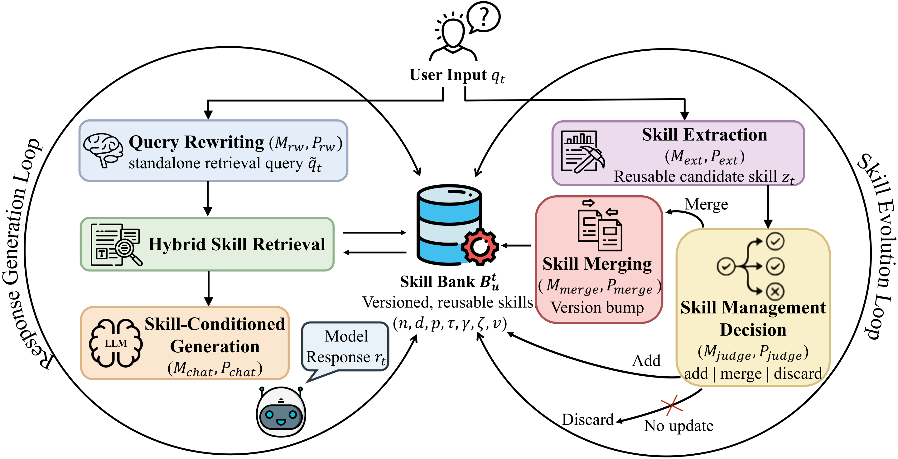

# AutoSkill: Experience-Driven Lifelong Learning via Skill Self-Evolution

English | [中文](README.zh-CN.md)

<p align="center">
  
</p>

<p align="center">
  <a href="https://github.com/ECNU-ICALK/AutoSkill"></a>
  <a href="https://arxiv.org/abs/2603.01145"></a>
  <a href="https://github.com/ECNU-ICALK/AutoSkill"></a>
  <a href="https://opensource.org/licenses/MIT"></a>
</p>

AutoSkill is a practical implementation of **Experience-driven Lifelong Learning (ELL)**.
It learns from real interaction experience (dialogue + agents), automatically creates reusable Skills,
and continuously evolves existing Skills through merge + version updates.



## News

- **2026-03-13**: **AutoSkill4Doc 1.0** released (Being expext by extracting skills from document/research paper).
- **2026-03-01**: Added offline skill extraction from archived conversations (See Skills in SkillBank/CovSkill).
- **2025-02-26**: **AutoSkill4OpenClaw 1.0** released (Extracting skills from trajectory of OpenClaw).
- **2025-02-04**: **AutoSkill 1.0** released (Extracting skills from dialogues in time).

## Table of Contents

- [News](#news)
- [1. Quick Start (Web / Proxy / Docker)](#1-quick-start-web--proxy--docker)
  - [1.1 Web UI](#11-web-ui)
  - [1.2 Standard API Proxy](#12-standard-api-proxy)
  - [1.3 One-click Deploy (Docker Compose)](#13-one-click-deploy-docker-compose)
  - [1.4 Skill Lifecycle Example (3 Aspects)](#14-skill-lifecycle-example-3-aspects)
- [2. What Makes AutoSkill Different](#2-what-makes-autoskill-different)
- [3. System Workflow](#3-system-workflow)
  - [3.1 Ingest and Evolve](#31-ingest-and-evolve)
  - [3.2 Retrieve and Respond](#32-retrieve-and-respond)
  - [3.3 Interactive Extraction Policy](#33-interactive-extraction-policy)
  - [3.4 Proxy Serving Flow](#34-proxy-serving-flow)
  - [3.5 Offline Document Architecture (AutoSkill4Doc)](#35-offline-document-architecture-autoskill4doc)
- [5. SkillBank Storage Layout](#5-skillbank-storage-layout)
- [6. Repository Structure (Readable Map)](#6-repository-structure-readable-map)
  - [6.1 Top Level](#61-top-level)
  - [6.2 Core SDK Modules](#62-core-sdk-modules)
  - [6.3 Skill Management Layer](#63-skill-management-layer)
  - [6.4 Interactive Layer](#64-interactive-layer)
  - [6.5 Example Entrypoints](#65-example-entrypoints)
  - [6.6 Offline Import](#66-offline-import)
- [7. SDK & Offline Usage](#7-sdk--offline-usage)
  - [7.1 Import OpenAI Conversations and Auto-Extract Skills](#71-import-openai-conversations-and-auto-extract-skills)
  - [7.2 Offline Conversation Extraction via CLI](#72-offline-conversation-extraction-via-cli)
- [8. Provider Setup](#8-provider-setup)
  - [8.1 DashScope (Example)](#81-dashscope-example)
  - [8.2 GLM (BigModel)](#82-glm-bigmodel)
  - [8.3 OpenAI / Anthropic](#83-openai--anthropic)
  - [8.4 InternLM (Intern-S1 Pro)](#84-internlm-intern-s1-pro)
  - [8.5 Generic URL-based Backends (LLM + Embeddings)](#85-generic-url-based-backends-llm--embeddings)
- [9. Runtime Workflows & APIs](#9-runtime-workflows--apis)
  - [9.1 Interactive Chat (retrieve every turn)](#91-interactive-chat-retrieve-every-turn)
  - [9.2 Web UI](#92-web-ui)
  - [9.3 Startup Offline Maintenance (Auto)](#93-startup-offline-maintenance-auto)
  - [9.4 OpenAI-Compatible Proxy API](#94-openai-compatible-proxy-api)
  - [9.5 Auto Evaluation Script](#95-auto-evaluation-script)
  - [9.6 AutoSkill4OpenClaw](#96-autoskill4openclaw)
- [11. Citation](#11-citation)
- [12. Contributions and Acknowledgments](#12-contributions-and-acknowledgments)

## 1. Quick Start (Web / Proxy / Docker)

### 1.1 Web UI

```bash
python3 -m pip install -e .
export INTERNLM_API_KEY="YOUR_INTERNLM_API_KEY"
export DASHSCOPE_API_KEY="YOUR_DASHSCOPE_API_KEY"
python3 -m examples.web_ui \
  --host 127.0.0.1 \
  --port 8000 \
  --llm-provider internlm \
  --embeddings-provider qwen \
  --store-dir SkillBank \
  --user-id u1 \
  --skill-scope all \
  --rewrite-mode always \
  --extract-mode auto \
  --extract-turn-limit 1 \
  --min-score 0.4 \
  --top-k 1
```

Open `http://127.0.0.1:8000`.

### 1.2 Standard API Proxy

AutoSkill can also be deployed as a reverse proxy that exposes OpenAI-compatible endpoints while transparently applying:
- skill retrieval/injection for each chat request
- asynchronous skill extraction/maintenance after responses

```bash
python3 -m pip install -e .
export INTERNLM_API_KEY="YOUR_INTERNLM_API_KEY"
export DASHSCOPE_API_KEY="YOUR_DASHSCOPE_API_KEY"
python3 -m examples.openai_proxy \
  --host 127.0.0.1 \
  --port 9000 \
  --llm-provider internlm \
  --embeddings-provider qwen \
  --served-model intern-s1-pro \
  --served-model gpt-5.2 \
  --store-dir SkillBank \
  --skill-scope all \
  --rewrite-mode always \
  --min-score 0.4 \
  --top-k 1
```

Endpoints:
- `POST /v1/chat/completions` (supports `stream=true`)
- `POST /v1/embeddings`
- `GET /v1/models`
- `GET /health`

Model catalog (`/v1/models`):
- use `--served-model <model_id>` repeatedly, or
- use `--served-models-json '[{"id":"gpt-5.2"},{"id":"gemini-3-pro-preview","object":"gemini","owned_by":"openai"}]'`
- if not configured, proxy returns the currently configured LLM model as a single default entry

Per-request user isolation (`--user-id` is optional at deploy time):
- request body field `user` (highest priority)
- or header `X-AutoSkill-User`
- or `Authorization: Bearer <JWT>` payload field `id`
- fallback to proxy default user (configured `--user-id`, or default `u1`)

Streaming chat curl example (`stream=true`):

```bash
curl -N http://127.0.0.1:9000/v1/chat/completions \
  -H "Content-Type: application/json" \
  -d '{
    "model": "intern-s1-pro",
    "stream": true,
    "messages": [
      {"role": "user", "content": "Write a concise summary of skill self-evolution."}
    ]
  }'
```

If proxy auth is enabled (`--proxy-api-key`), add:

```bash
-H "Authorization: Bearer $AUTOSKILL_PROXY_API_KEY"
```

### 1.3 One-click Deploy (Docker Compose)

```bash
cp .env.example .env
# edit .env and fill API keys (at least one LLM provider + one embedding provider)
docker compose up --build -d
```

After startup:
- Web UI: `http://127.0.0.1:8000`
- API Proxy: `http://127.0.0.1:9000`

Stop services:

```bash
docker compose down
```

The compose file starts both services:
- `autoskill-web` (`examples.web_ui`)
- `autoskill-proxy` (`examples.openai_proxy`)

Both share persistent local storage:
- host: `./SkillBank`
- container: `/data/SkillBank`

### 1.4 Skill Lifecycle Example (3 Aspects)

### A) Auto Decision + Feedback-triggered Extraction & Skill Management (v0.1.0)

If the user only asks to "write a report" and gives no stable preference/correction, AutoSkill does **not** create a new skill
(it outputs an empty extraction result) to avoid noisy, generic skills.

When the user adds durable constraints (for example: "do not hallucinate"), AutoSkill extracts or merges a skill into version `v0.1.0`.
Skill management is backend-first (automatic add/merge), with optional human edit/save/delete of `SKILL.md`.


*Caption: Daily scenario — reusable writing constraints are extracted into a new skill (`v0.1.0`).*


*Caption: Science scenario — reusable lab/process constraints (for example hard limits and mandatory SOP steps) are extracted as a skill (`v0.1.0`).*

### B) Skill Update (v0.1.1)

When user feedback adds new constraints or changes priorities in later turns, AutoSkill updates the existing skill (instead of creating duplicates)
and evolves the version from `v0.1.0` to `v0.1.1`.


*Caption: Daily scenario — later user feedback updates constraints and evolves the skill to `v0.1.1`.*


*Caption: Science scenario — follow-up technical feedback updates the existing science skill instead of creating duplicates (`v0.1.1`).*

### C) Skill Usage

For the next similar task (for example, writing a **government report about a self-evolving agent**), the updated skill is retrieved and used
to generate outputs aligned with user expectations.


*Caption: Daily scenario — the evolved skill is retrieved and reused in the next similar task.*


*Caption: Science scenario — the evolved science skill is retrieved for subsequent domain-consistent requests.*

## 2. What Makes AutoSkill Different

- **Experience-driven continuous skill evolution**: extracts reusable capabilities directly from real user interactions and behavior traces, then continuously maintains versioned skills so the system better aligns with user needs over time.
- **Universal skill format**: uses the Agent Skill artifact (`SKILL.md`) with clear explainability and editability: the structure is transparent, content is reviewable, and humans can revise it as needed; this also enables both importing existing skills and migrating extracted skills to other systems.
- **Offline skill extraction from completed chats**: once a chat is finished, there is no need to replay it with the model; directly import the existing conversation logs (OpenAI-format `.json/.jsonl`) and run offline extraction to produce reusable skills.
- **Long-term capability value**: AutoSkill turns short-term interactions into long-term capability assets. It reduces manual skill authoring cost, keeps capabilities aligned with real user feedback, and supports transfer/reuse across runtimes.

## 3. System Workflow

### 3.1 Ingest and Evolve

```text
Experience (messages/events)
  -> Skill Extraction (candidate)
  -> Skill Maintenance (add / merge / discard)
  -> Skill Store (Agent Skill artifact + vector index)
```

- Extractor emits at most one high-quality candidate per attempt.
- Maintainer checks similarity against existing skills, then decides add/merge/discard.
- Merge updates preserve and improve capabilities, then bump patch version.

### 3.2 Retrieve and Respond

```text
User Query (+ recent history)
  -> Query Rewrite (optional)
  -> Embedding + Vector Search
  -> Skill Selection for Context
  -> LLM Response
```

- Retrieval runs every turn.
- Similarity threshold and `top_k` control precision/recall.
- Retrieved skills are filtered again before context injection.
- The top-1 retrieved skill (only if it passes `min_score`) is passed to extraction as auxiliary identity context; extraction does not run a second retrieval internally.
- Retrieved skills are also audited asynchronously for actual relevance/usage in the final reply.
- Usage counters are isolated per user and can auto-prune stale user skills with defaults `retrieved >= 40` and `used <= 0`.

### 3.3 Interactive Extraction Policy

- `extract_mode=auto`: attempt extraction every `extract_turn_limit` turns.
- `extract_mode=always`: attempt every turn.
- `extract_mode=never`: disable auto extraction.
- `/extract_now [hint]`: force immediate background extraction for current context (alias: `extract_now [hint]`).
- Generic requests without user correction (for example, one-time report writing) should return no skill extraction.
- User feedback that encodes durable preferences/constraints (for example, "do not hallucinate") should trigger extraction or update.
- If a similar user skill already exists, prefer merge/update over creating a duplicate skill.

### 3.4 Proxy Serving Flow

```text
Client (OpenAI-compatible request)
  -> AutoSkill Proxy (/v1/chat/completions)
  -> Query rewrite + skill retrieval + context injection
  -> Upstream model generation
  -> Return response to client
  -> Async skill extraction/maintenance (background)
```

- Response latency focuses on retrieval + generation.
- Skill evolution runs asynchronously to avoid blocking the client.

### 3.5 Offline Document Architecture (AutoSkill4Doc)

```text
Documents
  -> ingest (DocumentRecord + TextUnit + StrictWindow + hash-based incremental skip)
  -> extract (SupportRecord + SkillDraft)
  -> compile (SkillSpec)
  -> versioning + registry (lifecycle / provenance / history)
  -> staged snapshots + final SkillBank store + visible family tree
```

- The old `autoskill/offline/document` module has been migrated into top-level `AutoSkill4Doc/`.
- The document pipeline is now standalone: use `autoskill4doc ...` or `python3 -m AutoSkill4Doc ...`.
- The current CLI exposes staged commands: `build`, `llm-extract`, `ingest`, `extract`, `compile`, `diag`, `retrieve-hierarchy`, `canonical-merge`, and `migrate-layout`.
- Detailed document-pipeline design and options: [AutoSkill4Doc/README.md](AutoSkill4Doc/README.md).

## 5. SkillBank Storage Layout

When using `store={"provider": "local", "path": "SkillBank"}`:

```text
SkillBank/
  Users/
    <user_id>/
      <skill-slug>/
        SKILL.md
        scripts/          (optional)
        references/       (optional)
        assets/           (optional)
  Common/
    <skill-slug>/SKILL.md
    <library>/<skill-slug>/SKILL.md
  vectors/
    <embedding-signature>.meta.json
    <embedding-signature>.ids.txt
    <embedding-signature>.vecs.f32
  index/
    skills-bm25.*          (persistent BM25 index files)
    skill_usage_stats.json (per-user retrieval/usage counters)
```

Notes:

- `Users/<user_id>`: user-specific skills.
- `Common/`: shared library skills (read-only in normal interactive usage).
- `vectors/`: persistent vector cache keyed by embedding signature, so switching embedding models will build/use separate indexes.
- `index/`: local keyword index (BM25) and usage statistics used by retrieval + automatic stale-skill pruning.
- Offline skills extracted from WildChat 1M are available under `SkillBank/Users` in:
  `chinese_gpt3.5_8`, `english_gpt3.5_8`, `chinese_gpt4_8`, and `english_gpt4_8`.

## 6. Repository Structure (Readable Map)

### 6.1 Top Level

- `autoskill/`: SDK core.
- `AutoSkill4Doc/`: standalone offline document-to-skill engine with its own CLI, config, windowing, extraction, compilation, and versioning modules.
- `examples/`: runnable demos and entry scripts.
- `autoskill/interactive/server.py`: OpenAI-compatible reverse proxy runtime.
- `AutoSkill4OpenClaw/`: embedded-first OpenClaw integration for automatic skill extraction, maintenance, and native skill mirroring.
- `web/`: static frontend assets for local Web UI.
- `SkillBank/`: default local storage root.
- `imgs/`: README demo images.
- `Dockerfile`: container image for AutoSkill runtime.
- `docker-compose.yml`: one-click deployment for Web UI + API Proxy.

### 6.2 Core SDK Modules

- `autoskill/client.py`: public SDK entrypoint (`ingest`, `search`, `render_context`, import/export).
- `autoskill/config.py`: global config model.
- `autoskill/models.py`: core data models (`Skill`, `SkillHit`, etc.).
- `autoskill/render.py`: convert selected skills into injectable context.
- `autoskill/interactive/unified.py`: unified composition root for interactive + proxy runtime wiring.

### 6.3 Skill Management Layer

- `autoskill/management/extraction.py`: extraction logic and prompts.
- `autoskill/management/maintenance.py`: merge/version/add-discard decisions.
- `autoskill/management/formats/agent_skill.py`: `SKILL.md` render/parse.
- `autoskill/management/stores/local.py`: directory-based storage + vector mapping.
- `autoskill/management/vectors/flat.py`: on-disk vector index backend.
- `autoskill/management/importer.py`: import external Agent Skills.

### 6.4 Interactive Layer

- `autoskill/interactive/app.py`: terminal interactive app orchestration.
- `autoskill/interactive/session.py`: headless session engine for Web/API usage.
- `autoskill/interactive/rewriting.py`: query rewriting for better retrieval.
- `autoskill/interactive/selection.py`: optional LLM skill selection before injection.

### 6.5 Example Entrypoints

- `examples/web_ui.py`: local Web UI server.
- `examples/interactive_chat.py`: CLI interactive chat.
- `examples/openai_proxy.py`: OpenAI-compatible proxy entrypoint.
- `examples/auto_evalution.py`: fully automated LLM-vs-LLM evolution evaluation.
- `examples/basic_ingest_search.py`: minimal offline SDK loop.

### 6.6 Offline Import

Migration note:
- `autoskill/offline/document` has been removed.
- Document offline pipeline is now maintained in `AutoSkill4Doc/` and is no longer routed through `autoskill.offline`.
- See [AutoSkill4Doc/README.md](AutoSkill4Doc/README.md) for full staged workflow and configuration details.

- `autoskill/offline/conversation/extract.py`: import OpenAI-format conversation `.json/.jsonl` (single file or directory), then extract and maintain skills.
- `AutoSkill4Doc/extract.py`: import offline document sources, build visible `domain root / Family技能 / 一级技能 / 二级技能 / 微技能` trees, inspect staging runs, and browse hierarchy.
- `autoskill/offline/trajectory/extract.py`: import offline agentic trajectory data and extract workflow skills.

Offline CLI examples (API keys via `export` env vars, same style as examples):

```bash
# 1) Provider setup (DashScope example)
export DASHSCOPE_API_KEY="YOUR_DASHSCOPE_API_KEY"
export DASHSCOPE_MODEL="qwen-plus"
export DASHSCOPE_EMBED_MODEL="text-embedding-v4"

# 2) Conversation -> skill extraction
python3 -m autoskill.offline.conversation.extract \
  --file ./data/random_50 \
  --user-id u1 \
  --llm-provider dashscope \
  --embeddings-provider dashscope

# 3) Document -> skill extraction
python3 -m AutoSkill4Doc llm-extract \
  --file ./data/docs \
  --domain psychology \
  --domain-type psychology \
  --family-name "认知行为疗法" \
  --llm-provider dashscope \
  --embeddings-provider dashscope \
  --max-chars-per-window 6000

# 4) Agentic trajectory -> skill extraction
python3 -m autoskill.offline.trajectory.extract \
  --file ./data/traces \
  --user-id u1 \
  --llm-provider dashscope \
  --embeddings-provider dashscope \
  --success-only 1 \
  --include-tool-events 1
```

## 7. SDK & Offline Usage

```python
from autoskill import AutoSkill, AutoSkillConfig

sdk = AutoSkill(
    AutoSkillConfig(
        llm={"provider": "mock"},
        embeddings={"provider": "hashing", "dims": 256},
        store={"provider": "local", "path": "SkillBank"},
    )
)

sdk.ingest(
    user_id="u1",
    messages=[
        {"role": "user", "content": "Before each release: run regression -> canary -> monitor -> full rollout."},
        {"role": "assistant", "content": "Understood."},
    ],
)

hits = sdk.search("How should I do a safe release?", user_id="u1", limit=3)
for h in hits:
    print(h.skill.name, h.score)
```

### 7.1 Import OpenAI Conversations and Auto-Extract Skills

```python
from autoskill import AutoSkill, AutoSkillConfig

sdk = AutoSkill(
    AutoSkillConfig(
        llm={"provider": "internlm", "model": "intern-s1-pro"},
        embeddings={"provider": "qwen", "model": "text-embedding-v4"},
        store={"provider": "local", "path": "SkillBank"},
    )
)

result = sdk.import_openai_conversations(
    user_id="u1",
    file_path="./data/openai_dialogues.jsonl",  # .json or .jsonl
    hint="Focus on reusable user preferences and workflows.",
    continue_on_error=True,
    max_messages_per_conversation=100,
)

print("processed:", result["processed"], "upserted:", result["upserted_count"])
for s in result.get("skills", [])[:5]:
    print("-", s.get("name"), s.get("version"))
```

Notes:
- Input format should be OpenAI-style conversations (`.json` / `.jsonl` with `messages`).
- During extraction, payload is structured into two parts:
  - `Primary User Questions (main evidence)` for skill evidence
  - `Full Conversation (context reference)` for disambiguation only
- In offline conversation extraction, user turns are primary evidence; assistant-side artifacts are excluded.

### 7.2 Offline Conversation Extraction via CLI

```bash
python3 -m autoskill.offline.conversation.extract \
  --file ./data/random_50 \
  --user-id u1 \
  --llm-provider dashscope \
  --embeddings-provider dashscope
```

Behavior:
- `--file` accepts one OpenAI-format `.json`/`.jsonl` file or a directory containing multiple files.
- If a single `.json` file contains multiple conversations, the loader iterates all conversations and extracts skills per conversation unit.
- The runner prints per-file progress in real time, including file name and extracted skill names.

## 8. Provider Setup

### 8.1 DashScope (Example)

```bash
export DASHSCOPE_API_KEY="YOUR_DASHSCOPE_API_KEY"
python3 -m examples.interactive_chat --llm-provider dashscope
```

### 8.2 GLM (BigModel)

```bash
export ZHIPUAI_API_KEY="YOUR_ID.YOUR_SECRET"
python3 -m examples.interactive_chat --llm-provider glm
```

### 8.3 OpenAI / Anthropic

```bash
export OPENAI_API_KEY="YOUR_OPENAI_KEY"
python3 -m examples.interactive_chat --llm-provider openai

export ANTHROPIC_API_KEY="YOUR_ANTHROPIC_KEY"
python3 -m examples.interactive_chat --llm-provider anthropic
```

### 8.4 InternLM (Intern-S1 Pro)

```bash
export INTERNLM_API_KEY="YOUR_INTERNLM_TOKEN"
python3 -m examples.interactive_chat --llm-provider internlm --llm-model intern-s1-pro
```

### 8.5 Generic URL-based Backends (LLM + Embeddings)

```bash
export AUTOSKILL_GENERIC_LLM_URL="http://XXX/v1"
export AUTOSKILL_GENERIC_LLM_MODEL="gpt-5.2"
export AUTOSKILL_GENERIC_EMBED_URL="http://XX/v1"
export AUTOSKILL_GENERIC_EMBED_MODEL="embd_qwen3vl8b"
# Optional (can be empty):
export AUTOSKILL_GENERIC_API_KEY=""

python3 -m examples.interactive_chat --llm-provider generic --embeddings-provider generic
```

## 9. Runtime Workflows & APIs

### 9.1 Interactive Chat (retrieve every turn)

```bash
export DASHSCOPE_API_KEY="YOUR_DASHSCOPE_API_KEY"
python3 -m examples.interactive_chat --llm-provider dashscope
```

Useful commands:

- `/extract_now [hint]`
- `/extract_every <n>`
- `/extract auto|always|never`
- `/scope user|common|all`
- `/search <query>`
- `/skills`
- `/export <skill_id>`

### 9.2 Web UI

```bash
export INTERNLM_API_KEY="YOUR_INTERNLM_API_KEY"
export DASHSCOPE_API_KEY="YOUR_DASHSCOPE_API_KEY"
python3 -m examples.web_ui --llm-provider internlm --embeddings-provider qwen
```

### 9.3 Startup Offline Maintenance (Auto)

When service runtime starts (`web_ui`, `interactive_chat`, `openai_proxy`), AutoSkill now runs offline checks automatically:
- normalize missing `id:` in `SKILL.md` under local store
- optionally import external skill directories when `AUTOSKILL_AUTO_IMPORT_DIRS` is configured

Optional environment controls:
- `AUTOSKILL_AUTO_NORMALIZE_IDS` (default: `1`)
- `AUTOSKILL_AUTO_IMPORT_DIRS` (comma-separated paths)
- `AUTOSKILL_AUTO_IMPORT_SCOPE` (`common`|`user`, default: `common`)
- `AUTOSKILL_AUTO_IMPORT_LIBRARY` (target library name when scope=`common`)
- `AUTOSKILL_AUTO_IMPORT_OVERWRITE` (default: `0`)
- `AUTOSKILL_AUTO_IMPORT_INCLUDE_FILES` (default: `1`)
- `AUTOSKILL_AUTO_IMPORT_MAX_DEPTH` (default: `6`)

### 9.4 OpenAI-Compatible Proxy API

```bash
export INTERNLM_API_KEY="YOUR_INTERNLM_API_KEY"
export DASHSCOPE_API_KEY="YOUR_DASHSCOPE_API_KEY"
python3 -m examples.openai_proxy --llm-provider internlm --embeddings-provider qwen
```

Discoverability:

```bash
curl http://127.0.0.1:9000/v1/autoskill/capabilities
curl http://127.0.0.1:9000/v1/autoskill/openapi.json
```

OpenAI-compatible:

- `POST /v1/chat/completions`
- `POST /v1/embeddings`
- `GET /v1/models`

Streaming chat example (`/v1/chat/completions`, SSE):

```bash
curl -N http://127.0.0.1:9000/v1/chat/completions \
  -H "Content-Type: application/json" \
  -d '{
    "model": "intern-s1-pro",
    "stream": true,
    "messages": [
      {"role": "user", "content": "Give me 3 points about AutoSkill."}
    ]
  }'
```

Skill APIs:

- `GET /v1/autoskill/skills`
- `GET /v1/autoskill/skills/{skill_id}`
- `GET /v1/autoskill/skills/{skill_id}/md`
- `PUT /v1/autoskill/skills/{skill_id}/md`
- `DELETE /v1/autoskill/skills/{skill_id}`
- `POST /v1/autoskill/skills/{skill_id}/rollback`
- `GET /v1/autoskill/skills/{skill_id}/versions`
- `GET /v1/autoskill/skills/{skill_id}/export`
- `POST /v1/autoskill/skills/search`
- `POST /v1/autoskill/skills/import`
- `POST /v1/autoskill/conversations/import`

Retrieval and extraction:

- `POST /v1/autoskill/retrieval/preview`
- `POST /v1/autoskill/extractions`
- `POST /v1/autoskill/extractions/simulate`
- `GET /v1/autoskill/extractions/latest`
- `GET /v1/autoskill/extractions`
- `GET /v1/autoskill/extractions/{job_id}`
- `GET /v1/autoskill/extractions/{job_id}/events` (SSE)

### 9.5 Auto Evaluation Script

Large-scale automated evaluation (LLM user simulator + LLM judge):

```bash
python3 -m examples.auto_evalution \
  --mode eval \
  --eval-strategy evolution \
  --base-url http://127.0.0.1:9000 \
  --sim-provider qwen \
  --sim-api-key "$AUTOSKILL_PROXY_API_KEY" \
  --sim-model qwen-plus \
  --judge-provider qwen \
  --judge-model qwen-plus \
  --judge-api-key "$AUTOSKILL_PROXY_API_KEY" \
  --report-json ./proxy_eval_report.json
```

### 9.6 AutoSkill4OpenClaw

Recommended embedded-first install for OpenClaw (auto wiring, no separate provider required at install time):

```bash
python3 AutoSkill4OpenClaw/install.py \
  --workspace-dir ~/.openclaw \
  --install-dir ~/.openclaw/plugins/autoskill-openclaw-plugin \
  --adapter-dir ~/.openclaw/extensions/autoskill-openclaw-adapter \
  --repo-dir "$(pwd)"
```

Full plugin guide (install, wiring, runtime flow, verification):
- `AutoSkill4OpenClaw/README.md`

The installer automatically:
- installs compatibility sidecar scripts
- installs native lifecycle adapter (`before_agent_start` / `agent_end`)
- writes adapter load path + plugin entry into `~/.openclaw/openclaw.json`
- enables adapter entry by default
- defaults the adapter to `runtimeMode=embedded` and `openclawSkillInstallMode=openclaw_mirror`

Important:
- After installation, restart OpenClaw runtime once so new plugin config is loaded.
- In the recommended embedded path, you do not need to start the sidecar process.
- If you explicitly want the optional sidecar path, manual provider defaults, or centralized operations, see `AutoSkill4OpenClaw/README.md`.

```bash
openclaw gateway restart
```

If your environment does not provide the `openclaw` CLI, restart the OpenClaw gateway/runtime process with your existing service manager.

This plugin is a skill service (retrieval + offline evolution), not a chat proxy.

- `base_url`: `http://127.0.0.1:9100/v1`
- `api_key`: value of `AUTOSKILL_PROXY_API_KEY` (or empty if disabled)
- hook endpoint: `POST /v1/autoskill/openclaw/hooks/before_agent_start`
- hook endpoint: `POST /v1/autoskill/openclaw/hooks/agent_end`
- compatibility endpoint: `POST /v1/autoskill/openclaw/turn`

Service examples:

```bash
curl -X POST http://127.0.0.1:9100/v1/autoskill/openclaw/turn \
  -H "Content-Type: application/json" \
  -d '{
    "messages": [
      {"role":"assistant","content":"What style do you want?"},
      {"role":"user","content":"Write a government report, no tables, avoid hallucinations."}
    ],
    "schedule_extraction": true
  }'
```

```bash
curl -X POST http://127.0.0.1:9100/v1/autoskill/conversations/import \
  -H "Content-Type: application/json" \
  -d '{
    "conversations": [
      {"messages":[
        {"role":"user","content":"Write a policy memo."},
        {"role":"assistant","content":"Draft ..."},
        {"role":"user","content":"More specific, avoid hallucinations."}
      ]}
    ]
  }'
```

Extraction event stream example:

```bash
curl -N http://127.0.0.1:9100/v1/autoskill/extractions/<job_id>/events \
  -H "Accept: text/event-stream"
```

Vector rebuild example:

```bash
curl http://127.0.0.1:9100/v1/autoskill/vectors/rebuild \
  -H "Content-Type: application/json" \
  -d '{
    "user": "u1",
    "scope": "all",
    "force": true,
    "blocking": true
  }'
```

## 11. Citation

If you use AutoSkill in academic work, technical reports, or demos, please cite:

```bibtex
@software{autoskill_2026,
  author = {Yutao Yang, Junsong Li, Qianjun Pan, Bihao Zhan, Yuxuan Cai, Lin Du, Xin Li, Bo Zhang, Qin Chen, Jie Zhou, Kai Chen, Liang He},
  title = {AutoSkill: Experience-Driven Lifelong Learning via Skill Self-Evolution},
  year = {2026},
  url = {https://github.com/ECNU-ICALK/AutoSkill},
  note = {GitHub repository}
}

@misc{yang2026autoskillexperiencedrivenlifelonglearning,
  title={AutoSkill: Experience-Driven Lifelong Learning via Skill Self-Evolution},
  author={Yutao Yang and Junsong Li and Qianjun Pan and Bihao Zhan and Yuxuan Cai and Lin Du and Jie Zhou and Kai Chen and Qin Chen and Xin Li and Bo Zhang and Liang He},
  year={2026},
  eprint={2603.01145},
  archivePrefix={arXiv},
  primaryClass={cs.AI},
  url={https://arxiv.org/abs/2603.01145},
}
```

## 12. Contributions and Acknowledgments

Institutions: Shanghai AI Laboratory, School of Computer Science at East China Normal University

Core Authors: Yutao Yang

Contribution: Junsong Li, Qianjun Pan, Bihao Zhan, Yuxuan Cai, Lin Du

Lead Authors: Jie Zhou, Kai Chen, Liang He

Scientific Directors: Xin Li, Bo Zhang, Qin Chen
